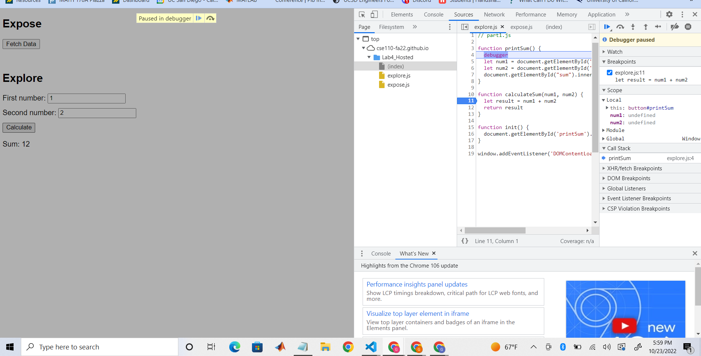
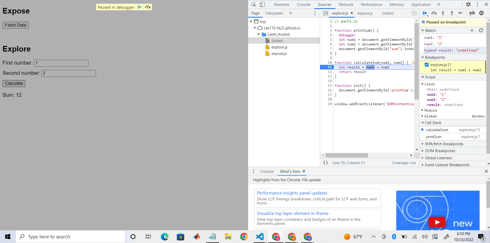
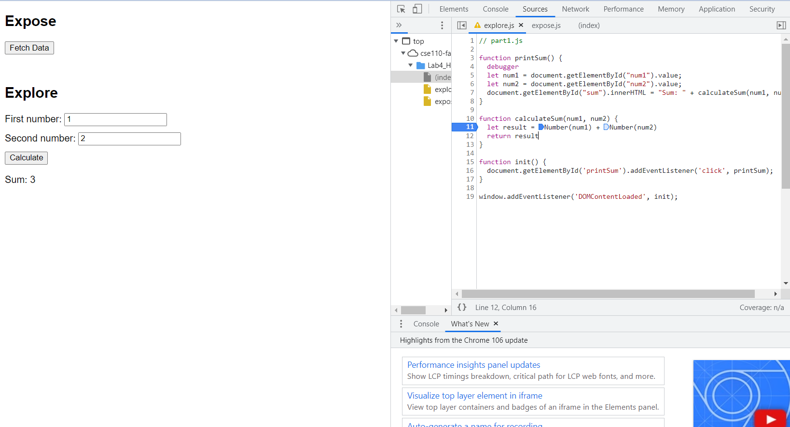

DevTools Debugging
---
---

__Section 1: ScreenShots__
__1. When the debugger is triggered, set a breakpoint at the initialization of the local variable result in calculateSum(). Take a screenshot of the list of breakpoints containing the breakpoint you just added. Name it result-calculateSum.png (or whatever image extension you would like to use)__

__2. Add watch expressions to find the value of num1 and num2, and the data type of result. Take a screenshot of the watch expressions list. Name it result-dataType.png (or whatever image extension you would like to use)__

---
---
__Section 2: Questions__

__1. What was the bug?__

The bug was that the two values were being concatenated together. If the first number was 1 and the second number was 2, they were seen as "1" + "2" which resulted in "12" instead of 3.

__2. How would you fix it? Include a screenshot of your fix. Name it fix.png (or whatever image extension you would like to use)__  

I was able to fix the issue by type casting the strings into numbers. So, Number(num1) + Number(num2) would result in the sum of the two values.

